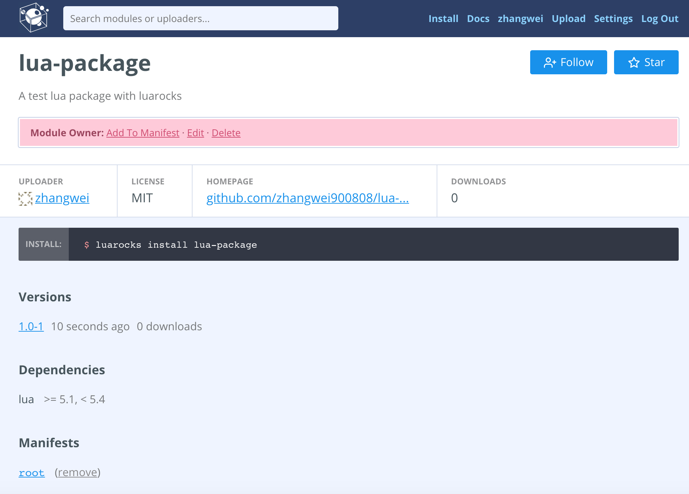

# how-to-create-a-rock

## 1、什么是Luarocks？
Luarocks是一个Lua包管理器，基于Lua语言开发，提供一个命令行的方式来管理Lua包依赖、安装第三方Lua包等，社区比较流行的包管理器之一，另还有一个LuaDist，Luarocks的包数量比LuaDist多，更细节的两者对比可[参阅这里](http://notebook.kulchenko.com/zerobrane/lua-package-managers-luadist-luarocks-and-integration-with-zerobrane-studio)。

## 2、源码安装Luarocks

```
wget https://luarocks.org/releases/luarocks-2.4.1.tar.gz
tar -zxvf luarocks-2.4.1.tar.gz
cd luarocks-2.4.1
./configure
make build && make install
cd ..
```

## 3、创建.rockspec文件并修改

```
mkdir lua-package
cd lua-package
luarocks write_rockspec
```

执行完之后会发现多了一个 lua-package-dev-1.rockspec 文件，这个文件就是我们创建的 .rockspec 文件，接着我们打开这个文件，查看里面的元信息，如下所示

```
#该包名
package = "lua-package"
#版本号(注意：1、版本号和你文件名所包含的版本号要一致，如这里的版本号是：dev-1，文件名是：lua-package-dev-1.rockspec
#2、版本号要以-x结尾，如0.0.1-1，1.3-1，如果你不按照这种规则定义则会报错！)
version = "dev-1"
source = {
   #指定源码的位置(一般我们会发布到git所在的托管服务器，如我托管的是github就可以填写github托管地址了)
   url = "*** please add URL for source tarball, zip or repository here ***"
}
description = {
   #该包所在的说明文档位置(我托管的是github，所以这里可以填写分支在gh-pages所在的url)
   homepage = "*** please enter a project homepage ***",
   #指明所基于的开源协议
   license = "*** please specify a license ***"
}
build = {
   #编译方式
   type = "builtin",
   #指定包含的模块
   modules = {}
}
```
现在我们来修改下 rockspec 文件，如下所示：

```
package = "lua-package"
version = "1.0-1"
source = {
   #这里我指定的是我当前包所在的github托管地址
   url = "git://github.com/zhangwei900808/lua-package.git",
   #指定tag版本号(注意这里的tag要和version保持一致否则安装会报错)
   tag = "v1.0-1",
   #设置为master分支
   branch = "master"
}
description = {
   #设置描述信息
   summary = "A test lua package with luarocks",
   #源码所在的说明文档地址
   homepage = "https://github.com/zhangwei900808/lua-package",
   #指定维护者信息
   maintainer = "zhangwei<zw900808@gmail.com>",
   #指定开源协议
   license = "MIT"
}
#设置Lua的依赖环境
dependencies = {
  "lua >= 5.1, < 5.4"
}
build = { 
   type = "builtin",
   modules = {}
}
```

注意：version 现在已经改成了 1.0-1 所以文件名也要改成lua-package-1.0-1.rockspec

## 4、创建lua-package.lua文件，并修改rockspec文件
```
touch lua-package.lua
```
创建好之后，接着我们编辑这个文件，加入下面代码

```
local _M = {}
_M._VERSION = '0.1'

local mt = { __index = _M }

function _M.new( self, firstname, lastname )
    return setmetatable({
        firstname = firstname,
        lastname = lastname
    }, mt)
end

function _M.get_fullname(self)
    return self.firstname .. self.lastname
end

return _M

```

修改之后，我们在rockspec文件里面加上这段
```
modules = {
     ["lua-package"] = "lua-package.lua"
   }
```

完整的rockspec代码如下所示：

```
package = "lua-package"
version = "1.0-1"
source = {
   url = "git://github.com/zhangwei900808/lua-package.git",
   tag = "v1.0-1",
   branch = "master"
}
description = {
   summary = "A test lua package with luarocks",
   homepage = "https://github.com/zhangwei900808/lua-package",
   maintainer = "zhangwei<zw900808@gmail.com>",
   license = "MIT"
}
dependencies = {
  "lua >= 5.1, < 5.4"
}
build = {
   type = "builtin",
   modules = {
     ["lua-package"] = "lua-package.lua"
   }
}
```

## 5、添加github tag到rockspec文件中
```
#注意：这里的标签名必须和version一致，否则后面操作会报错
git tag v1.0-1
git push --tags
```

## 6、注册luarocks并创建api-key
注册地址[在这](https://luarocks.org/)，注册完成之后，点击菜单里面的 Settings ，进去之后再点击 API keys，在这里你就可以创建自己的api-keys了，创建好之后复制一下，接下来我们会用到。

## 7、上传你的lua-package包
```
luarocks upload your-rockspec-name.rockspec --api-key=your-api-key
```
成功之后，我们到luarocks[官网](https://luarocks.org/)看看你刚上传的包，如下是我上传的结果



## 8、安装并使用lua-package包
```
luarocks install lua-package
```
接下来我们写一段代码测试下lua-package可用性，如下所示：

```
location /test {
    content_by_lua_block {
        local package = require("lua-package")
        local packageObj = package:new('zhang', 'wei')
        ngx.say(packageObj:get_fullname())
    }
}
```
启动这段代码，并访问查看输出结果：

```
curl "http://127.0.0.1/test"

zhangwei
```

## 9 、引用
1).[]()
1).[]()
1).[]()
1).[]()
1).[]()
1).[]()
1).[]()
1).[]()
1).[]()
1).[]()